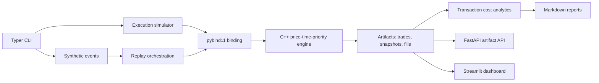

# Microstructure-Lab

[](https://github.com/MrRobotop/microstructure-lab/actions/workflows/ci.yml)
[](https://www.python.org/)
[](https://isocpp.org/)
[](LICENSE)

Microstructure-Lab is a professional market microstructure research and execution
simulation platform. It combines a tested C++ price-time-priority matching engine with a
Python research layer for deterministic synthetic order flow, execution strategies,
transaction cost analytics, reports, a CLI, API, dashboard, Docker, and CI.

Author: Rishabh Patil ([MrRobotop](https://github.com/MrRobotop)).

The project is built to demonstrate the intersection of trading infrastructure and
execution research:

- C++ systems code for the matching engine.
- Python for research workflows, analytics, reports, API, and dashboard.
- Deterministic synthetic data so anyone can run the demo without paid market data.
- Explicit transaction cost metrics, including fill rate and unfilled quantity.
- Honest limitations: synthetic results are not real trading evidence.

## What You Can Do

With this repository you can:

- generate deterministic synthetic market events
- replay an order book through a C++ matching engine
- run execution strategies such as TWAP, VWAP, POV, Iceberg, and Adaptive POV
- compare strategies on the same synthetic scenario
- compute transaction cost metrics and Markdown reports
- inspect run manifests and stored artifacts
- serve run artifacts through FastAPI
- launch a Streamlit dashboard
- benchmark local C++ engine event application

## Architecture



C++ owns the market mechanics: orders, trades, limit order book state, event application,
snapshots, cancellations, partial fills, full fills, and price-time-priority matching.
Prices are integer ticks inside the engine.

Python owns the research platform: CLI commands, synthetic data generation, execution
strategy orchestration, analytics, reporting, run manifests, API, and dashboard. Python
does not duplicate the matching engine.

## Repository Status

The current implementation includes:

- C++17 matching engine with direct C++ tests
- pybind11 Python extension via CMake and scikit-build-core
- deterministic synthetic event generation and replay
- execution strategies: TWAP, VWAP, POV, Iceberg, Adaptive POV
- transaction cost analytics and Markdown reports
- deterministic end-to-end demo
- run manifests and artifact index
- FastAPI artifact service
- Streamlit artifact dashboard
- conservative benchmark command
- Docker and Docker Compose
- GitHub Actions CI
- ruff, mypy, pytest, and documentation checks

## Requirements

- Python 3.11 or newer
- CMake 3.20 or newer
- C++17-capable compiler
- Docker optional, for containerized runs

The development extra installs Python-packaged build tools where available, including
CMake and Ninja.

## Getting Started

Clone the repository:

```bash
git clone https://github.com/MrRobotop/microstructure-lab.git
cd microstructure-lab
```

Create an environment and install the package:

```bash
python -m venv .venv
source .venv/bin/activate
python -m pip install -U pip
make install
```

Verify the installation:

```bash
microstructure-lab --help
make test-cpp
make test
```

Run the deterministic demo:

```bash
make demo
```

Expected result:

- synthetic events are generated
- the book is replayed through the C++ engine
- TWAP and POV are run on the same synthetic stream
- transaction cost metrics are computed
- artifacts are written under `artifacts/runs/demo`
- the terminal prints the Markdown report path

The demo requires no paid data and no external market data feed.

## Quick CLI Workflow

Generate synthetic events:

```bash
microstructure-lab simulate generate \
  --scenario normal \
  --seed 42 \
  --events 200 \
  --output data/synthetic/events.csv
```

Replay the order book:

```bash
microstructure-lab book replay \
  --events data/synthetic/events.csv \
  --output artifacts/runs/book_replay
```

Run one execution strategy:

```bash
microstructure-lab execute run \
  --strategy twap \
  --side buy \
  --quantity 10000 \
  --duration 60 \
  --events data/synthetic/events.csv \
  --output artifacts/runs/twap_demo
```

Compare strategies:

```bash
microstructure-lab execute compare \
  --strategies twap,vwap,pov,iceberg,adaptive \
  --scenario normal \
  --seed 42 \
  --output artifacts/runs/comparison
```

Write an analytics report:

```bash
microstructure-lab analytics report \
  --run artifacts/runs/comparison \
  --output artifacts/reports/comparison.md
```

Run the benchmark:

```bash
microstructure-lab benchmark engine --events 100000 --scenario normal
```

Inspect run metadata:

```bash
microstructure-lab runs list
microstructure-lab runs show --run-id comparison-normal-42-twap-vwap-pov-iceberg-adaptive
```

Canonical one-line commands:

```bash
microstructure-lab simulate generate --scenario normal --seed 42 --output data/synthetic/events.csv
microstructure-lab book replay --events data/synthetic/events.csv --output artifacts/runs/book_replay
microstructure-lab execute run --strategy twap --side buy --quantity 10000 --duration 60 --events data/synthetic/events.csv --output artifacts/runs/twap_demo
microstructure-lab execute compare --strategies twap,vwap,pov,iceberg,adaptive --scenario normal --seed 42 --output artifacts/runs/comparison
microstructure-lab analytics report --run artifacts/runs/comparison --output artifacts/reports/comparison.md
microstructure-lab benchmark engine --events 100000 --scenario normal
microstructure-lab api serve
microstructure-lab dashboard run
```

## What To Expect In Artifacts

Runs write artifacts under `artifacts/runs/` and reports under `artifacts/reports/`.
Generated artifacts are intentionally ignored by Git.

Typical outputs include:

- `events.csv`: deterministic synthetic event stream
- `trades.csv`: trades produced by order book replay
- `snapshots.csv`: top-of-book snapshots
- `child_orders.csv`: strategy child orders
- `fills.csv`: realized fills
- `result.json`: execution result summary
- `summary.json`: strategy comparison summary
- `comparison_report.md`: Markdown strategy comparison report
- `manifest.json`: reproducibility metadata with command, hashes, metrics, and limitations

Run manifests are indexed in `artifacts/runs/index.json` for the API and dashboard.

## Transaction Cost Metrics

The analytics layer reports unit-explicit metrics, including:

- arrival price
- average fill price
- realized quantity
- fill rate
- unfilled quantity
- implementation shortfall in ticks and basis points
- VWAP slippage when a benchmark is available
- spread cost when spread input is available
- time to completion
- participation rate
- opportunity cost
- adverse selection proxy where feasible

Metrics that require unavailable benchmarks are marked unavailable rather than silently
filled with assumptions.

## API And Dashboard

Serve stored artifacts through FastAPI:

```bash
microstructure-lab api serve
```

Launch the Streamlit dashboard:

```bash
microstructure-lab dashboard run
```

Both read stored artifacts. They do not require real market data.

## Docker

Build the image:

```bash
docker build -t microstructure-lab .
```

Run CLI help:

```bash
docker run --rm microstructure-lab
```

Run with Compose:

```bash
docker compose up microstructure-lab
docker compose up api
docker compose up dashboard
```

## Development Checks

Use these before pushing:

```bash
make lint
make typecheck
make docs-check
make test-cpp
make test
make demo-smoke
```

Available Make targets:

```bash
make install
make test
make lint
make typecheck
make docs-check
make format
make build-cpp
make test-cpp
make demo
```

## Synthetic Data And Limitations

All public demos use deterministic synthetic data. Event files include explicit
`scenario`, `seed`, and `is_synthetic` fields. Replay rejects rows that are not marked
synthetic.

This project does not claim live trading readiness, real venue calibration, production
broker routing, or real alpha generation. Strategy comparisons are controlled engineering
experiments over synthetic order flow.

Read [Limitations](docs/limitations.md) before interpreting any output.

## Documentation

- [Architecture](docs/architecture.md)
- [Development](docs/development.md)
- [Market microstructure notes](docs/market_microstructure.md)
- [Execution algorithms](docs/execution_algorithms.md)
- [Analytics](docs/analytics.md)
- [Performance](docs/performance.md)
- [Limitations](docs/limitations.md)
- [Recruiter summary](docs/recruiter_summary.md)

## License

This project is licensed under the MIT License. See [LICENSE](LICENSE).
